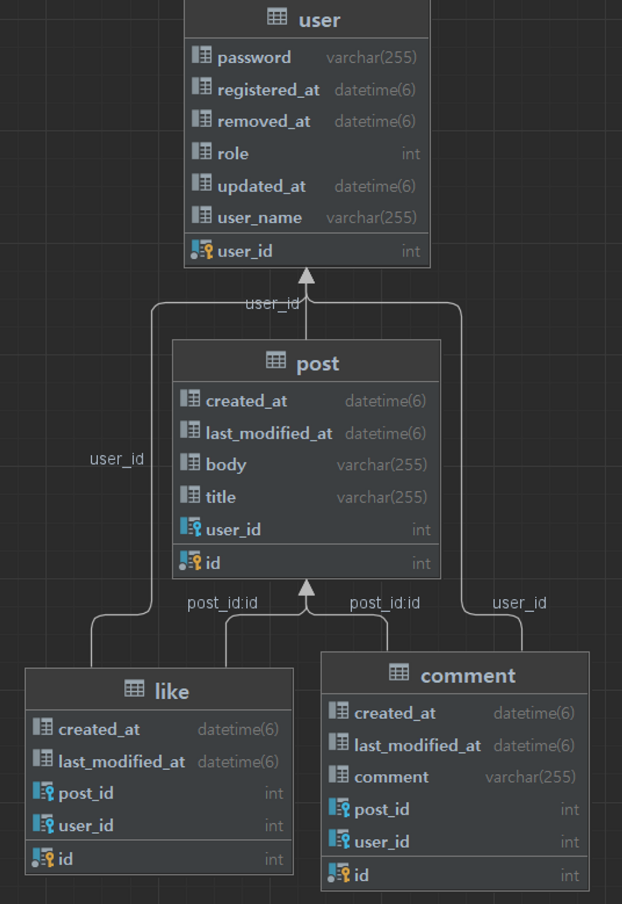

# 프로젝트 소개
> 종합 프로젝트를 통해서 만들어볼 서비스는 “멋사스네스(MutsaSNS)”입니다. 

# EndPoint
> 기본 URL
```shell
/api/v1
```
<br>

## 회원 인증/인가
> 회원 URL
```shell
/users
```

### 회원가입
POST `/join`
- 입력 폼(JSON 형식)
```json
{
	"userName" : "user1",
	"password" : "user1234"
}
```
- 리턴 (JSON 형식)
```json
{
  "resultCode": "SUCCESS",
  "result": {
    "userId": 5,
    "userName": "test1"
  }
}
```

### 로그인
POST `/login`
- 입력 폼(JSON 형식)
```json
{
  "userName" : "user1",
  "password" : "user1234"
}
```
- 리턴 (JSON 형식)
```json
{
  "jwt": "eyJhbGciOiJIU"
}
```

## 포스트
> 포스트 URL
```shell
/posts
```

### 포스트 리스트
GET
- 리턴 (JSON 형식)
```json
{"content":
[
  {"id":4,"title":"test","body":"body","userName":"test","createdAt":"2022-12-16T16:50:37.515952"},
  {"id":3,"title":"string","body":"string","userName":"kyeongrok","createdAt":"2022-12-16T15:13:19.663287"},
  {"id":1,"title":"title1","body":"body1","userName":"yeram_test1","createdAt":null},
  {"id":2,"title":"title1","body":"body1","userName":"yeram_test1","createdAt":null}],
  "pageable":
  {"sort":{"empty":false,"unsorted":false,"sorted":true},
    "offset":0,"pageNumber":0,"pageSize":20,"paged":true,"unpaged":false},
  "last":true,"totalElements":4,"totalPages":1,"size":20,"number":0,
  "sort":{"empty":false,"unsorted":false,"sorted":true},
  "numberOfElements":4,"first":true,"empty":false}
```

### 포스트 상세
GET `/posts/{postsId}`
- 리턴 (JSON 형식)
```json
{
  "id" : 1,
  "title" : "title1",
  "body" : "body",
  "userName" : "user1",
  "createdAt" : yyyy-mm-dd hh:mm:ss,
  "lastModifiedAt" : yyyy-mm-dd hh:mm:ss
}
```

### 포스트 등록
POST `/posts`
- 입력 폼(JSON 형식)
```json
{
  "title" : "title1",
  "body" : "body1"
}
```
- 리턴 (JSON 형식)
```json
{
  "resultCode":"SUCCESS",
  "result":{
    "message":"포스트 등록 완료",
    "postId":0
  }
}
```
### 포스트 수정
PUT `/posts/{id}`
- 입력 폼(JSON 형식)
```json
{
  "title" : "modified title",
  "body" : "modified body"
}
```
- 리턴 (JSON 형식)
```json
{
  "resultCode":"SUCCESS",
  "result":{
    "message":"포스트 수정 완료",
    "postId":0
  }
}
```

### 포스트 삭제
DELETE `/posts/{id}`
- 입력 폼(JSON 형식)
```json
{
  "id" : "post id"
}
```
- 리턴 (JSON 형식)
```json
{
  "resultCode":"SUCCESS",
  "result":{
    "message":"포스트 삭제 완료",
    "postId":0
  }
}
```


# ERD
